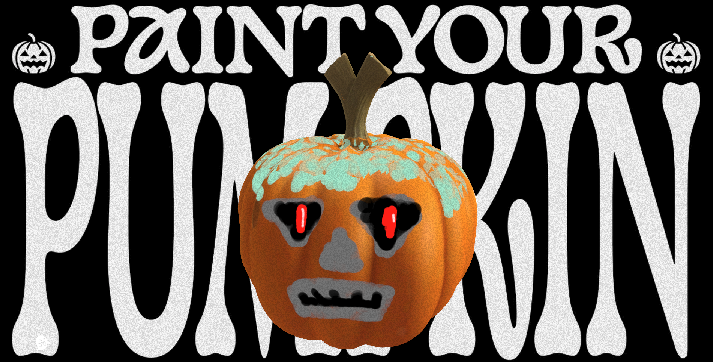

# Paint your pumpkin 🎃



An interactive Three.js experience where you carve and paint your own Halloween pumpkin.

🔗 **Live demo:** [paint-your-pumpkin.netlify.app](https://paint-your-pumpkin.netlify.app/)

## About

This project was built for the **"Halloween 2"** challenge of Bruno Simon's [Three.js Journey](https://threejs-journey.com/) course.

📎 Challenge: [threejs-journey.com/challenges/014-halloween-2](https://threejs-journey.com/challenges/014-halloween-2)

## Tech stack

- [Nuxt 3](https://nuxt.com/)
- [Three.js](https://threejs.org/)
- [GSAP](https://gsap.com/)
- [n8ao](https://github.com/N8python/n8ao) for post-processing ambient occlusion
- [Tailwind CSS](https://tailwindcss.com/)

## Getting started

This project uses [Bun](https://bun.sh/).

```bash
# install dependencies
bun install

# start the dev server
bun dev

# build for production
bun run build

# preview the production build
bun run preview
```

## Credits

The pumpkin 3D model was AI-generated with [meshy.ai](https://www.meshy.ai).
